# FintelligenceAI: Intelligent RAG Pipeline & AI Agent System

## Project Overview

FintelligenceAI is a comprehensive framework for building modular RAG (Retrieval-Augmented Generation) pipelines and AI agents using DSPy. The system enables end-to-end development of domain-specific language generation models with intelligent retrieval capabilities.

**Primary Use Case**: Generate Ergo smart contract scripts through RAG-powered AI agents with deep understanding of the Ergo blockchain ecosystem.

## Vision Statement

Create a flexible, optimizable AI system that can understand complex technical documentation and generate high-quality domain-specific code (starting with Ergo scripts) through intelligent retrieval and generation pipelines.

## Core Architecture

### System Architecture Diagram

```mermaid
graph TB
    %% User Interface Layer
    User[👤 User]
    WebUI[🌐 Web Interface]
    API[🔌 REST API]
    SDK[📦 Python SDK]
    CLI[💻 CLI Tool]

    %% Core System Components
    Agent[🤖 AI Agent System]
    RAG[🔍 RAG Pipeline]
    DSPy[⚡ DSPy Framework]

    %% Agent Components
    AgentOrch[🎭 Agent Orchestrator]
    ResearchAgent[🔬 Research Agent]
    GenAgent[🛠️ Generation Agent]
    ValidAgent[✅ Validation Agent]

    %% RAG Components
    Retrieval[📥 Retrieval Engine]
    Generation[📝 Generation Engine]
    Rerank[🔄 Reranker]

    %% Data Layer
    VectorDB[(🗄️ Vector Database<br/>ChromaDB)]
    ErgoKB[(📚 ErgoScript<br/>Knowledge Base)]
    SessionDB[(💾 Session<br/>Database)]
    MetricsDB[(📊 Metrics<br/>Database)]

    %% External Tools & Services
    ErgoNode[⛓️ Ergo Blockchain Node]
    DocSources[📖 Documentation Sources]
    GitRepos[📂 GitHub Repositories]
    Community[👥 Community Resources]

    %% Optimization & Monitoring
    Optimizer[🎯 DSPy Optimizer<br/>MIPROv2]
    Monitor[📈 Monitoring System]
    Feedback[🔄 Feedback Loop]

    %% User Interactions
    User --> WebUI
    User --> API
    User --> SDK
    User --> CLI

    %% Interface to Core System
    WebUI --> API
    SDK --> API
    CLI --> API
    API --> Agent
    API --> RAG

    %% Agent System Flow
    Agent --> AgentOrch
    AgentOrch --> ResearchAgent
    AgentOrch --> GenAgent
    AgentOrch --> ValidAgent

    %% Agent Tools Integration
    ResearchAgent --> RAG
    ResearchAgent --> DocSources
    GenAgent --> RAG
    GenAgent --> DSPy
    ValidAgent --> ErgoNode
    ValidAgent --> ErgoKB

    %% RAG Pipeline Flow
    RAG --> Retrieval
    RAG --> Generation
    Retrieval --> VectorDB
    Retrieval --> Rerank
    Rerank --> Generation
    Generation --> DSPy

    %% Data Sources
    DocSources --> ErgoKB
    GitRepos --> ErgoKB
    Community --> ErgoKB
    ErgoKB --> VectorDB

    %% Session & Memory Management
    Agent --> SessionDB
    API --> SessionDB

    %% Optimization Flow
    Generation --> Optimizer
    Agent --> Optimizer
    Optimizer --> DSPy
    Optimizer --> Feedback

    %% Monitoring & Analytics
    API --> Monitor
    Agent --> Monitor
    RAG --> Monitor
    Monitor --> MetricsDB
    Monitor --> Feedback

    %% Feedback Integration
    User --> Feedback
    Feedback --> Optimizer
    Feedback --> ErgoKB

    %% Styling
    classDef userLayer fill:#e1f5fe
    classDef coreSystem fill:#f3e5f5
    classDef dataLayer fill:#e8f5e8
    classDef external fill:#fff3e0
    classDef optimization fill:#fce4ec

    class User,WebUI,API,SDK,CLI userLayer
    class Agent,RAG,DSPy,AgentOrch,ResearchAgent,GenAgent,ValidAgent,Retrieval,Generation,Rerank coreSystem
    class VectorDB,ErgoKB,SessionDB,MetricsDB dataLayer
    class ErgoNode,DocSources,GitRepos,Community external
    class Optimizer,Monitor,Feedback optimization
```



### Architecture Components

### 1. Modular RAG Pipeline
- **Retrieval System**: Vector-based semantic search with domain-specific embeddings
- **Generation Engine**: DSPy-powered modules (ChainOfThought, ReAct) for contextual generation
- **Optimization Layer**: Automated prompt/weight optimization using DSPy optimizers (MIPROv2, BootstrapFinetune)
- **Evaluation Framework**: Domain-specific metrics for code quality and accuracy

### 2. AI Agent Framework
- **Tool Integration**: Function calling for code validation, documentation lookup, blockchain queries
- **Memory Management**: Context-aware conversation handling with persistent knowledge
- **Multi-Agent Orchestration**: Specialized agents for different aspects (research, generation, validation)
- **RAG Integration**: Seamless access to retrieval systems for informed decision-making

### 3. Ergo-Specific Implementation
- **ErgoScript Knowledge Base**: Curated documentation, examples, and best practices
- **Code Generation Pipeline**: Specialized modules for ErgoScript syntax and semantics
- **Validation Tools**: Integration with Ergo node for script compilation and testing
- **Domain Metrics**: ErgoScript-specific evaluation criteria

## Technical Stack

### Core Dependencies
- **DSPy**: Framework for programming language models
- **LangChain**: Additional tooling for complex agent workflows
- **ChromaDB/Pinecone**: Vector database for retrieval
- **FastAPI**: API framework for deployment
- **Pydantic**: Data validation and settings management

### Language Models
- **Primary**: GPT-4o-mini for development, GPT-4 for production
- **Fallback**: Claude-3 or local models (Llama 3.2)
- **Embeddings**: OpenAI text-embedding-3-large or open-source alternatives

### Infrastructure
- **Development**: Local development with Docker containers
- **Production**: Cloud deployment (AWS/GCP) with auto-scaling
- **Monitoring**: LangSmith for LLM observability, custom metrics for domain performance

## Database Schema

### Vector Store Collections
```python
# Ergo Documentation Collection
{
  "id": "doc_uuid",
  "content": "text_content",
  "metadata": {
    "source": "official_docs|github|examples",
    "category": "syntax|api|examples|best_practices",
    "complexity": "beginner|intermediate|advanced",
    "tags": ["contracts", "tokens", "dapps"],
    "last_updated": "timestamp"
  },
  "embedding": [vector_dimensions]
}

# Code Examples Collection
{
  "id": "example_uuid",
  "code": "ergoscript_code",
  "description": "what_the_code_does",
  "metadata": {
    "type": "complete_contract|snippet|pattern",
    "use_case": "token|auction|oracle|dex",
    "complexity": "beginner|intermediate|advanced",
    "tested": true|false,
    "performance_notes": "optional_notes"
  },
  "embedding": [vector_dimensions]
}
```

### Application Database
```sql
-- User sessions and conversation history
CREATE TABLE user_sessions (
    id UUID PRIMARY KEY,
    user_id VARCHAR(255),
    session_data JSONB,
    created_at TIMESTAMP,
    last_active TIMESTAMP
);

-- Generated code tracking
CREATE TABLE generated_scripts (
    id UUID PRIMARY KEY,
    session_id UUID REFERENCES user_sessions(id),
    prompt TEXT,
    generated_code TEXT,
    validation_result JSONB,
    user_feedback INTEGER, -- 1-5 rating
    created_at TIMESTAMP
);

-- RAG performance metrics
CREATE TABLE rag_metrics (
    id UUID PRIMARY KEY,
    query TEXT,
    retrieved_docs JSONB,
    generation_quality FLOAT,
    user_satisfaction INTEGER,
    execution_time_ms INTEGER,
    created_at TIMESTAMP
);
```

## Knowledge Base Ingestion System

### Overview

FintelligenceAI features a comprehensive knowledge ingestion system designed for efficient, scalable, and intelligent processing of diverse content sources. The system provides real-time progress tracking, detailed file management, and robust database operations for optimal knowledge base management.

### Enhanced Ingestion Architecture

#### High-Performance GitHub Processing
- **Git Clone Strategy**: Replaced slow GitHub API calls with fast `git clone --depth 1` operations
- **Performance Improvement**: ~100x faster processing (691 files in 3.9 seconds vs. hours with API)
- **Batch Processing**: Entire repositories cloned once, then processed locally
- **Smart Exclusions**: Automatically skips build directories (`node_modules`, `.git`, `dist`, `build`)

#### Real-Time Progress Tracking
```bash
🐙 Cloning & processing GitHub repos: [███████████████░░░░░░░░░░░░░░░]   50.0% (1/2) | ETA: 44s | Current: Processing eips files
```

Features:
- **Visual Progress Bars**: Unicode-based progress visualization
- **ETA Calculation**: Real-time estimated time to completion
- **Processing Speed**: Items/second and time per item metrics
- **Current Status**: Shows exactly what's being processed
- **Phase Tracking**: Separate progress for cloning vs. processing

#### Detailed File Tracking & Manifest System

**GitHub Repository Manifest** (`knowledge-base/processed/github_manifest.json`):
```json
{
  "https://github.com/ergo-pad/ergo-python-appkit": {
    "repo_name": "ergo-python-appkit",
    "processed_at": "2025-06-10T22:40:50.099438",
    "files_count": 6,
    "files": [
      {
        "path": "README.md",
        "name": "README.md",
        "extension": ".md",
        "category": "reference",
        "size_bytes": 1024,
        "url": "https://github.com/ergo-pad/ergo-python-appkit/blob/main/README.md"
      }
    ]
  }
}
```

**Tracked Information Per File**:
- File path within repository
- File name and extension
- Categorization (reference, examples, general)
- File size in bytes
- Direct GitHub URL for reference
- Processing timestamp

### Content Sources & Processing

#### Supported File Types
- **Documentation**: `.md`, `.txt`, `.html`, `.rst`, `.tex`
- **Code Files**: `.py`, `.js`, `.es` (ErgoScript)
- **Data Files**: `.json`, `.csv`
- **Documents**: `.pdf`, `.docx`

#### Upload Methods
- **Individual Files**: Upload single or multiple files at once
- **Directory Upload**: Upload entire directories with preserved folder structure
- **Bulk Processing**: Handle multiple files and nested directories simultaneously
- **Structure Preservation**: Maintain original directory organization when uploading folders

#### Content Source Types

**1. Local Files** (`knowledge-base/documents/`)
```
knowledge-base/
├── documents/
│   ├── ergoscript-basics.md
│   ├── contract-examples.py
│   └── api-reference.json
```

**2. Web URLs** (`knowledge-base/urls.txt`)
```
https://docs.ergoplatform.com/dev/start/
https://ergoscript.org/language-description/
# Comments supported with #
```

**3. GitHub Repositories** (`knowledge-base/github-repos.txt`)
```
https://github.com/ergoplatform/eips
https://github.com/ergo-pad/ergo-python-appkit
ergoplatform/ergoscript-examples  # Short format supported
```

**4. Category Organization** (`knowledge-base/categories/`)
```
categories/
├── tutorials/       # Beginner-friendly guides
├── examples/        # Code examples and patterns
├── reference/       # API docs and specifications
└── guides/          # How-to guides and best practices
```

### Database Management Commands

#### Basic Ingestion
```bash
# Process all sources with progress tracking
python scripts/ingest_knowledge.py

# Process specific folder only
python scripts/ingest_knowledge.py --folder categories/tutorials

# Preview without changes
python scripts/ingest_knowledge.py --dry-run

# Force re-processing of all files
python scripts/ingest_knowledge.py --force
```

#### Content Visualization
```bash
# Show hierarchical tree of processed content
python scripts/ingest_knowledge.py --show-tree

# Display detailed GitHub repository manifest
python scripts/ingest_knowledge.py --show-manifest
```

**Example Tree Output**:
```
🌳 Processed Content Tree:
────────────────────────────────────────
📊 Summary:
   🐙 GitHub Repositories: 2
   📄 Local Files: 1
   📝 File Types: .md(23), .py(6)
   📂 Categories: reference(2), examples(5), general(22)

📁 GitHub Repositories
├── 🐙 ergo-python-appkit
│   ├── 📄 📊 6 files processed
│   ├── 📄 📂 Reference: 1 files
│   │   └── • README.md
│   └── 📄 📂 Examples: 5 files
│       ├── • appkit.py
│       ├── • ErgoBox.py
│       └── • ... and 3 more
└── 🐙 eips
    ├── 📄 📊 23 files processed
    └── 📄 📂 General: 22 files
        ├── • eip-0022.md
        └── • ... and 21 more
```

#### Database Maintenance
```bash
# Clear entire vector database and start fresh
python scripts/ingest_knowledge.py --clear-db

# Remove specific repository from tracking
python scripts/ingest_knowledge.py --remove-repo "https://github.com/microsoft/vscode-docs"
```

### Advanced Configuration

#### Custom Configuration File (`.knowledge-config.json`)
```json
{
  "default_category": "general",
  "default_difficulty": "intermediate",
  "chunk_size": 1000,
  "chunk_overlap": 200,
  "supported_extensions": [".md", ".py", ".js", ".json"],
  "exclude_patterns": [
    "**/node_modules/**",
    "**/.git/**",
    "**/dist/**",
    "**/build/**"
  ],
  "file_patterns": {
    "tutorials": ["*tutorial*", "*guide*", "*howto*"],
    "examples": ["*example*", "*demo*", "*sample*"],
    "reference": ["*api*", "*reference*", "*spec*"]
  }
}
```

#### Environment Configuration
```bash
# GitHub API token for enhanced rate limits (optional but recommended)
GITHUB_TOKEN=ghp_xxxxxxxxxxxx

# Processing preferences
KNOWLEDGE_DEFAULT_CATEGORY=general
KNOWLEDGE_CHUNK_SIZE=1000
KNOWLEDGE_CHUNK_OVERLAP=200
```

### Performance Optimizations

#### GitHub Processing Improvements
- **Before**: Individual API calls per file (rate-limited, slow)
- **After**: Single clone + local processing (fast, reliable)
- **Speed Increase**: ~100x improvement for large repositories
- **Example**: 691 files from vscode-docs processed in 3.9 seconds

#### Memory Management
- **Streaming Processing**: Files processed one at a time to minimize memory usage
- **Temporary Cleanup**: Automatic cleanup of cloned repositories
- **Batch Operations**: Vector embeddings created in efficient batches

#### Intelligent Categorization
- **Path-Based**: Automatic categorization based on file location
- **Content-Based**: Filename pattern matching for category assignment
- **Manual Override**: Category specification via configuration

### Monitoring & Troubleshooting

#### Logging System
```bash
# Real-time log monitoring
tail -f knowledge-base/processed/ingestion.log

# Error investigation
grep -i error knowledge-base/processed/ingestion.log

# Performance analysis
grep "processed repository" knowledge-base/processed/ingestion.log
```

#### Processing Statistics
- **Files Processed**: Count of individual files ingested
- **Documents Created**: Number of vector database entries
- **Processing Speed**: Items per second and time per item
- **Error Tracking**: Detailed error logs with context
- **Duration Metrics**: Total processing time and phase breakdowns

#### Common Issues & Solutions

**GitHub Rate Limiting**:
```bash
# Check rate limit status
python scripts/check_github_rate_limit.py

# Setup GitHub token for unlimited access
python scripts/setup_github_token.py
```

**Large Repository Processing**:
- Use `--force` flag sparingly to avoid re-processing
- Monitor disk space during cloning operations
- Consider processing repositories individually for debugging

**Memory Issues**:
- Process folders incrementally with `--folder` option
- Reduce `chunk_size` in configuration for memory-constrained environments
- Use `--dry-run` to preview processing load

### Integration with RAG Pipeline

The ingestion system seamlessly integrates with the RAG pipeline:

1. **Content Processing**: Documents chunked and embedded automatically
2. **Metadata Preservation**: Rich metadata maintained for retrieval context
3. **Category-Based Retrieval**: Queries can be scoped to specific content categories
4. **Source Tracking**: Retrieved content includes original source attribution
5. **Update Management**: Incremental updates avoid re-processing unchanged content

## Key Features

### 1. Intelligent Code Generation
- Context-aware ErgoScript generation based on natural language descriptions
- Integration with Ergo blockchain documentation and examples
- Automatic code validation and optimization suggestions

### 2. Multi-Modal Retrieval
- Semantic search across documentation, code examples, and community resources
- Hybrid search combining vector similarity and keyword matching
- Dynamic relevance scoring based on query complexity and context

### 3. Adaptive Learning
- Continuous improvement through DSPy optimizers
- User feedback integration for personalized model enhancement
- A/B testing framework for evaluation of different approaches

### 4. Production-Ready Deployment
- RESTful API with comprehensive documentation
- Scalable architecture with load balancing
- Real-time monitoring and alerting
- Security best practices for API access

## Success Metrics

### Technical Metrics
- **Code Accuracy**: >90% syntactically correct ErgoScript generation
- **Semantic Correctness**: >85% functionally accurate implementations
- **Retrieval Relevance**: >0.8 average relevance score for retrieved documents
- **Response Time**: <3 seconds for code generation requests
- **System Uptime**: >99.5% availability

### User Experience Metrics
- **User Satisfaction**: >4.2/5 average rating
- **Task Completion Rate**: >85% successful code generation sessions
- **Learning Curve**: <30 minutes time-to-first-success for new users
- **Adoption Rate**: Growing user base with regular engagement

## Development Phases

### Phase 1: Foundation (Weeks 1-4) ✅ COMPLETED
- ✅ Core RAG pipeline implementation
- ✅ Enhanced ErgoScript knowledge base with intelligent ingestion
- ✅ Initial DSPy module development
- ✅ Local development environment
- ✅ High-performance knowledge ingestion system
- ✅ Real-time progress tracking and monitoring
- ✅ Database management and content visualization tools

### Phase 2: Enhancement (Weeks 5-8)
- AI agent framework development
- Advanced retrieval strategies
- DSPy optimization integration
- Comprehensive evaluation suite

### Phase 3: Production (Weeks 9-12)
- API development and documentation
- Deployment infrastructure
- Monitoring and observability
- User interface development

### Phase 4: Optimization (Ongoing)
- Continuous model improvement
- User feedback integration
- Performance optimization
- Feature expansion

## Risk Mitigation

### Technical Risks
- **Model Hallucination**: Implement validation layers and confidence scoring
- **Retrieval Quality**: Multi-stage evaluation and feedback loops
- **Scalability**: Modular architecture with caching and optimization
- **Integration Complexity**: Comprehensive testing and documentation

### Business Risks
- **User Adoption**: Focus on developer experience and clear value proposition
- **Competition**: Leverage DSPy's unique optimization capabilities
- **Maintenance**: Automated testing and monitoring systems
- **Cost Management**: Efficient model usage and optimization strategies

## 🚀 Quick Start with Docker

### Prerequisites

- **Docker & Docker Compose**: Required for containerized deployment
- **Git**: For cloning the repository
- **4GB+ RAM**: Recommended for optimal performance
- **10GB+ Disk Space**: For Docker images and data storage

### Automated Setup (Recommended)

The fastest way to get FintelligenceAI running is using our automated Docker setup script:

1. **Clone the repository**
   ```bash
   git clone https://github.com/marctheshark3/FintelligenceAI.git
   cd FintelligenceAI
   ```

2. **Run the automated setup script**
   ```bash
   chmod +x scripts/docker-setup.sh
   ./scripts/docker-setup.sh
   ```

3. **Choose your deployment mode** when prompted:
   - **Development** (1): Hot reloading + dev tools
   - **Production** (2): Optimized for performance
   - **Basic** (3): Minimal services
   - **Local AI** (4): Includes Ollama for local models

### Setup Script Features

The `docker-setup.sh` script provides:

- ✅ **System Validation**: Checks Docker installation and requirements
- ✅ **Environment Configuration**: Creates secure `.env` file automatically
- ✅ **API Key Setup**: Optional interactive API key configuration
- ✅ **Password Generation**: Automatic secure password generation
- ✅ **Service Orchestration**: Starts all services in chosen mode
- ✅ **Health Verification**: Waits for services to be ready

### Available Script Options

```bash
# Full interactive setup (recommended for first-time users)
./scripts/docker-setup.sh

# Quick start if you already have .env configured
./scripts/docker-setup.sh --start-only

# Setup environment file only
./scripts/docker-setup.sh --env-only

# Check system requirements without installing
./scripts/docker-setup.sh --check-only

# Stop all services
./scripts/docker-setup.sh --stop

# Reset everything (⚠️ destructive - removes all data)
./scripts/docker-setup.sh --reset

# Show help and all options
./scripts/docker-setup.sh --help
```

### Access Points

Once setup is complete, you can access:

- **🌐 Web Interface**: http://localhost:3000
- **📊 API Documentation**: http://localhost:8000/docs
- **🔍 API Health Check**: http://localhost:8000/health
- **📈 Grafana Dashboard**: http://localhost:3001
- **🔧 Prometheus Metrics**: http://localhost:9090

### API Key Configuration

FintelligenceAI supports multiple AI providers:

- **OpenAI**: Required for GPT models (recommended)
- **Anthropic**: For Claude models (optional)
- **GitHub Token**: For enhanced repository access (optional)
- **Local Models**: Ollama (automatically configured in Local AI mode)

**Post-Setup Configuration**: Edit API keys in `.env` file and restart:

```bash
nano .env  # Edit your configuration
docker-compose restart
```

## Next Steps

1. **Quick Start**: Use the automated Docker setup script above
2. **API Integration**: Connect to the API endpoints for custom applications
3. **Knowledge Base**: Add your own documents using the ingestion system
4. **Customization**: Adapt the RAG pipeline for your specific use case
5. **Production Deployment**: Scale using production-ready Docker configurations

## Contributing Guidelines

- Follow DSPy best practices for module development
- Maintain comprehensive test coverage (>80%)
- Document all APIs and configuration options
- Use type hints and Pydantic models for data validation
- Implement proper logging and error handling

## Resources

- [DSPy Documentation](https://dspy.ai/)
- [Ergo Platform Documentation](https://docs.ergoplatform.com/)
- [ErgoScript Language Guide](https://ergoplatform.org/docs/ErgoScript.pdf)
- [DSPy GitHub Repository](https://github.com/stanfordnlp/dspy)

---

**Last Updated**: June 2025
**Version**: 1.1
**Status**: Active Development

### Recent Updates (June 2025)
- ✅ **Automated Docker Setup**: Complete one-command deployment with interactive setup script
- ✅ **Enhanced Knowledge Ingestion System**: Complete rewrite with 100x performance improvement
- ✅ **Real-Time Progress Tracking**: Visual progress bars and ETA calculations
- ✅ **GitHub Repository Manifest**: Detailed file tracking and metadata management
- ✅ **Database Management Tools**: Clear, remove, and visualize knowledge base content
- ✅ **Advanced Content Categorization**: Intelligent file categorization and organization
- ✅ **Directory Upload Support**: Upload entire directories with preserved folder structure via web UI
- ✅ **Production-Ready Infrastructure**: Multi-environment Docker configurations with monitoring
- ✅ **UI-API Integration**: Fixed connectivity and CORS configuration for seamless operation
