# FintelligenceAI: Intelligent RAG Pipeline & AI Agent System

## Project Overview

FintelligenceAI is a comprehensive framework for building modular RAG (Retrieval-Augmented Generation) pipelines and AI agents using DSPy. The system enables end-to-end development of domain-specific language generation models with intelligent retrieval capabilities.

**Primary Use Case**: Generate Ergo smart contract scripts through RAG-powered AI agents with deep understanding of the Ergo blockchain ecosystem.

## Vision Statement

Create a flexible, optimizable AI system that can understand complex technical documentation and generate high-quality domain-specific code (starting with Ergo scripts) through intelligent retrieval and generation pipelines.

## Core Architecture

### System Architecture Diagram

```mermaid
graph TB
    %% User Interface Layer
    User[👤 User]
    WebUI[🌐 Web Interface]
    API[🔌 REST API]
    SDK[📦 Python SDK]
    CLI[💻 CLI Tool]

    %% Core System Components
    Agent[🤖 AI Agent System]
    RAG[🔍 RAG Pipeline]
    DSPy[⚡ DSPy Framework]

    %% Agent Components
    AgentOrch[🎭 Agent Orchestrator]
    ResearchAgent[🔬 Research Agent]
    GenAgent[🛠️ Generation Agent]
    ValidAgent[✅ Validation Agent]

    %% RAG Components
    Retrieval[📥 Retrieval Engine]
    Generation[📝 Generation Engine]
    Rerank[🔄 Reranker]

    %% Data Layer
    VectorDB[(🗄️ Vector Database<br/>ChromaDB)]
    ErgoKB[(📚 ErgoScript<br/>Knowledge Base)]
    SessionDB[(💾 Session<br/>Database)]
    MetricsDB[(📊 Metrics<br/>Database)]

    %% External Tools & Services
    ErgoNode[⛓️ Ergo Blockchain Node]
    DocSources[📖 Documentation Sources]
    GitRepos[📂 GitHub Repositories]
    Community[👥 Community Resources]

    %% Optimization & Monitoring
    Optimizer[🎯 DSPy Optimizer<br/>MIPROv2]
    Monitor[📈 Monitoring System]
    Feedback[🔄 Feedback Loop]

    %% User Interactions
    User --> WebUI
    User --> API
    User --> SDK
    User --> CLI

    %% Interface to Core System
    WebUI --> API
    SDK --> API
    CLI --> API
    API --> Agent
    API --> RAG

    %% Agent System Flow
    Agent --> AgentOrch
    AgentOrch --> ResearchAgent
    AgentOrch --> GenAgent
    AgentOrch --> ValidAgent

    %% Agent Tools Integration
    ResearchAgent --> RAG
    ResearchAgent --> DocSources
    GenAgent --> RAG
    GenAgent --> DSPy
    ValidAgent --> ErgoNode
    ValidAgent --> ErgoKB

    %% RAG Pipeline Flow
    RAG --> Retrieval
    RAG --> Generation
    Retrieval --> VectorDB
    Retrieval --> Rerank
    Rerank --> Generation
    Generation --> DSPy

    %% Data Sources
    DocSources --> ErgoKB
    GitRepos --> ErgoKB
    Community --> ErgoKB
    ErgoKB --> VectorDB

    %% Session & Memory Management
    Agent --> SessionDB
    API --> SessionDB

    %% Optimization Flow
    Generation --> Optimizer
    Agent --> Optimizer
    Optimizer --> DSPy
    Optimizer --> Feedback

    %% Monitoring & Analytics
    API --> Monitor
    Agent --> Monitor
    RAG --> Monitor
    Monitor --> MetricsDB
    Monitor --> Feedback

    %% Feedback Integration
    User --> Feedback
    Feedback --> Optimizer
    Feedback --> ErgoKB

    %% Styling
    classDef userLayer fill:#e1f5fe
    classDef coreSystem fill:#f3e5f5
    classDef dataLayer fill:#e8f5e8
    classDef external fill:#fff3e0
    classDef optimization fill:#fce4ec

    class User,WebUI,API,SDK,CLI userLayer
    class Agent,RAG,DSPy,AgentOrch,ResearchAgent,GenAgent,ValidAgent,Retrieval,Generation,Rerank coreSystem
    class VectorDB,ErgoKB,SessionDB,MetricsDB dataLayer
    class ErgoNode,DocSources,GitRepos,Community external
    class Optimizer,Monitor,Feedback optimization
```



### Architecture Components

### 1. Modular RAG Pipeline
- **Retrieval System**: Vector-based semantic search with domain-specific embeddings
- **Generation Engine**: DSPy-powered modules (ChainOfThought, ReAct) for contextual generation
- **Optimization Layer**: Automated prompt/weight optimization using DSPy optimizers (MIPROv2, BootstrapFinetune)
- **Evaluation Framework**: Domain-specific metrics for code quality and accuracy

### 2. AI Agent Framework
- **Tool Integration**: Function calling for code validation, documentation lookup, blockchain queries
- **Memory Management**: Context-aware conversation handling with persistent knowledge
- **Multi-Agent Orchestration**: Specialized agents for different aspects (research, generation, validation)
- **RAG Integration**: Seamless access to retrieval systems for informed decision-making

### 3. Ergo-Specific Implementation
- **ErgoScript Knowledge Base**: Curated documentation, examples, and best practices
- **Code Generation Pipeline**: Specialized modules for ErgoScript syntax and semantics
- **Validation Tools**: Integration with Ergo node for script compilation and testing
- **Domain Metrics**: ErgoScript-specific evaluation criteria

## Technical Stack

### Core Dependencies
- **DSPy**: Framework for programming language models
- **LangChain**: Additional tooling for complex agent workflows
- **ChromaDB/Pinecone**: Vector database for retrieval
- **FastAPI**: API framework for deployment
- **Pydantic**: Data validation and settings management

### Language Models
- **Primary**: GPT-4o-mini for development, GPT-4 for production
- **Fallback**: Claude-3 or local models (Llama 3.2)
- **Embeddings**: OpenAI text-embedding-3-large or open-source alternatives

### Infrastructure
- **Development**: Local development with Docker containers
- **Production**: Cloud deployment (AWS/GCP) with auto-scaling
- **Monitoring**: LangSmith for LLM observability, custom metrics for domain performance

## Database Schema

### Vector Store Collections
```python
# Ergo Documentation Collection
{
  "id": "doc_uuid",
  "content": "text_content", 
  "metadata": {
    "source": "official_docs|github|examples",
    "category": "syntax|api|examples|best_practices",
    "complexity": "beginner|intermediate|advanced",
    "tags": ["contracts", "tokens", "dapps"],
    "last_updated": "timestamp"
  },
  "embedding": [vector_dimensions]
}

# Code Examples Collection  
{
  "id": "example_uuid",
  "code": "ergoscript_code",
  "description": "what_the_code_does",
  "metadata": {
    "type": "complete_contract|snippet|pattern",
    "use_case": "token|auction|oracle|dex",
    "complexity": "beginner|intermediate|advanced",
    "tested": true|false,
    "performance_notes": "optional_notes"
  },
  "embedding": [vector_dimensions]
}
```

### Application Database
```sql
-- User sessions and conversation history
CREATE TABLE user_sessions (
    id UUID PRIMARY KEY,
    user_id VARCHAR(255),
    session_data JSONB,
    created_at TIMESTAMP,
    last_active TIMESTAMP
);

-- Generated code tracking
CREATE TABLE generated_scripts (
    id UUID PRIMARY KEY,
    session_id UUID REFERENCES user_sessions(id),
    prompt TEXT,
    generated_code TEXT,
    validation_result JSONB,
    user_feedback INTEGER, -- 1-5 rating
    created_at TIMESTAMP
);

-- RAG performance metrics
CREATE TABLE rag_metrics (
    id UUID PRIMARY KEY,
    query TEXT,
    retrieved_docs JSONB,
    generation_quality FLOAT,
    user_satisfaction INTEGER,
    execution_time_ms INTEGER,
    created_at TIMESTAMP
);
```

## Key Features

### 1. Intelligent Code Generation
- Context-aware ErgoScript generation based on natural language descriptions
- Integration with Ergo blockchain documentation and examples
- Automatic code validation and optimization suggestions

### 2. Multi-Modal Retrieval
- Semantic search across documentation, code examples, and community resources
- Hybrid search combining vector similarity and keyword matching
- Dynamic relevance scoring based on query complexity and context

### 3. Adaptive Learning
- Continuous improvement through DSPy optimizers
- User feedback integration for personalized model enhancement
- A/B testing framework for evaluation of different approaches

### 4. Production-Ready Deployment
- RESTful API with comprehensive documentation
- Scalable architecture with load balancing
- Real-time monitoring and alerting
- Security best practices for API access

## Success Metrics

### Technical Metrics
- **Code Accuracy**: >90% syntactically correct ErgoScript generation
- **Semantic Correctness**: >85% functionally accurate implementations
- **Retrieval Relevance**: >0.8 average relevance score for retrieved documents
- **Response Time**: <3 seconds for code generation requests
- **System Uptime**: >99.5% availability

### User Experience Metrics
- **User Satisfaction**: >4.2/5 average rating
- **Task Completion Rate**: >85% successful code generation sessions
- **Learning Curve**: <30 minutes time-to-first-success for new users
- **Adoption Rate**: Growing user base with regular engagement

## Development Phases

### Phase 1: Foundation (Weeks 1-4)
- Core RAG pipeline implementation
- Basic ErgoScript knowledge base
- Initial DSPy module development
- Local development environment

### Phase 2: Enhancement (Weeks 5-8)  
- AI agent framework development
- Advanced retrieval strategies
- DSPy optimization integration
- Comprehensive evaluation suite

### Phase 3: Production (Weeks 9-12)
- API development and documentation
- Deployment infrastructure
- Monitoring and observability
- User interface development

### Phase 4: Optimization (Ongoing)
- Continuous model improvement
- User feedback integration
- Performance optimization
- Feature expansion

## Risk Mitigation

### Technical Risks
- **Model Hallucination**: Implement validation layers and confidence scoring
- **Retrieval Quality**: Multi-stage evaluation and feedback loops
- **Scalability**: Modular architecture with caching and optimization
- **Integration Complexity**: Comprehensive testing and documentation

### Business Risks
- **User Adoption**: Focus on developer experience and clear value proposition
- **Competition**: Leverage DSPy's unique optimization capabilities
- **Maintenance**: Automated testing and monitoring systems
- **Cost Management**: Efficient model usage and optimization strategies

## Next Steps

1. **Environment Setup**: Initialize development environment with DSPy and dependencies
2. **Data Collection**: Gather and curate ErgoScript documentation and examples
3. **Prototype Development**: Build minimal viable RAG pipeline
4. **Iterative Enhancement**: Apply DSPy optimizers and expand capabilities
5. **Production Preparation**: Develop deployment infrastructure and monitoring

## Contributing Guidelines

- Follow DSPy best practices for module development
- Maintain comprehensive test coverage (>80%)
- Document all APIs and configuration options
- Use type hints and Pydantic models for data validation
- Implement proper logging and error handling

## Resources

- [DSPy Documentation](https://dspy.ai/)
- [Ergo Platform Documentation](https://docs.ergoplatform.com/)
- [ErgoScript Language Guide](https://ergoplatform.org/docs/ErgoScript.pdf)
- [DSPy GitHub Repository](https://github.com/stanfordnlp/dspy)

---

**Last Updated**: January 2025  
**Version**: 1.0  
**Status**: Planning Phase 