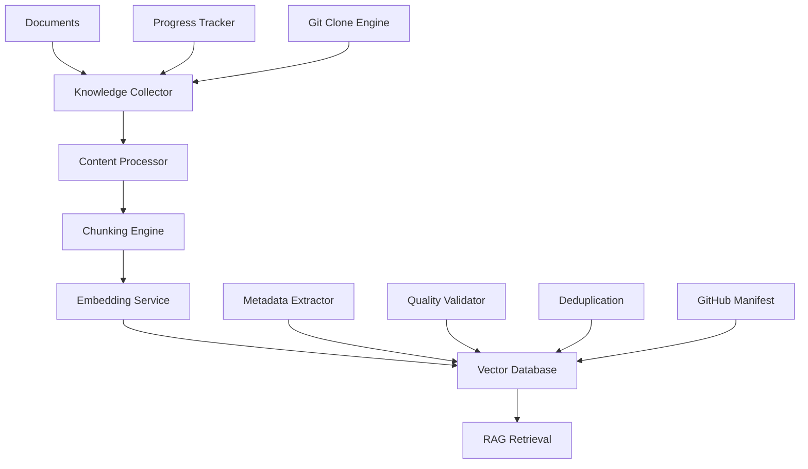

# Knowledge Base Management Guide

> Complete guide to managing the FintelligenceAI knowledge base for optimal RAG performance

## 📖 Table of Contents

- [Overview](#overview)
- [Architecture](#architecture)
- [Adding Knowledge Sources](#adding-knowledge-sources)
- [Knowledge Processing Pipeline](#knowledge-processing-pipeline)
- [Supported Formats](#supported-formats)
- [Best Practices](#best-practices)
- [API Usage](#api-usage)
- [CLI Tools](#cli-tools)
- [Monitoring & Maintenance](#monitoring--maintenance)
- [Troubleshooting](#troubleshooting)

## Overview

The FintelligenceAI knowledge base is a vector-powered semantic storage system that enables intelligent retrieval for RAG (Retrieval-Augmented Generation) workflows. It processes and indexes various document types to provide context-aware information retrieval.

### Key Features

- **Multi-format Support**: PDF, Markdown, Text, Code, and Web content
- **Semantic Chunking**: Intelligent document segmentation
- **Vector Embeddings**: High-quality semantic representations
- **Metadata Enrichment**: Automatic tag and category extraction
- **Version Control**: Track knowledge base changes
- **Quality Assurance**: Content validation and deduplication

## Architecture



### Enhanced Components

1. **Knowledge Collector**: High-performance ingestion from various sources
2. **Git Clone Engine**: Fast repository processing via `git clone --depth 1`
3. **Content Processor**: Cleans and normalizes content with categorization
4. **Chunking Engine**: Segments documents intelligently
5. **Embedding Service**: Generates semantic vectors with batch processing
6. **Vector Database**: Stores and indexes embeddings with ChromaDB
7. **Metadata Extractor**: Extracts structural information and file details
8. **Quality Validator**: Ensures content quality with scoring
9. **Progress Tracker**: Real-time progress visualization with ETA
10. **GitHub Manifest**: Detailed tracking of repository files and metadata

### Performance Enhancements

#### GitHub Processing Revolution
- **Before**: Individual GitHub API calls (rate-limited, slow)
- **After**: Single `git clone` + local processing (fast, reliable)
- **Performance**: ~100x improvement (691 files in 3.9 seconds vs. hours)
- **Benefits**: No rate limiting, offline processing, batch operations

#### Real-Time Progress Tracking
```bash
🐙 Cloning & processing GitHub repos: [███████████████░░░░░░░░░░░░░░░]   50.0% (1/2) | ETA: 44s | Current: Processing eips files
```

**Features**:
- Visual Unicode progress bars
- Real-time ETA calculations
- Processing speed metrics (items/second)
- Current operation status
- Phase-specific tracking (clone → process)

## Adding Knowledge Sources

### 1. Using the API

#### Upload Single Document

```python
import requests

# Upload a document
with open('document.pdf', 'rb') as f:
    response = requests.post(
        'http://localhost:8000/knowledge/upload',
        files={'file': f},
        data={
            'category': 'smart_contracts',
            'tags': 'ergo,ergoscript,token',
            'source': 'official_docs'
        }
    )

print(response.json())
```

#### Bulk Upload

```python
import requests
import os

def bulk_upload(directory_path, category="general"):
    """Upload all documents in a directory."""
    files = []

    for filename in os.listdir(directory_path):
        if filename.endswith(('.pdf', '.md', '.txt')):
            file_path = os.path.join(directory_path, filename)
            files.append(('files', open(file_path, 'rb')))

    response = requests.post(
        'http://localhost:8000/knowledge/bulk-upload',
        files=files,
        data={'category': category}
    )

    # Close all files
    for _, file in files:
        file.close()

    return response.json()

# Upload all documents in a directory
result = bulk_upload('./docs/ergoscript/', 'ergoscript_docs')
```

#### Add Web Content

```python
# Add content from URLs
urls = [
    'https://docs.ergoplatform.com/dev/smart-contracts/',
    'https://github.com/ergoplatform/eips/blob/master/eip-0004.md'
]

response = requests.post(
    'http://localhost:8000/knowledge/web-scrape',
    json={
        'urls': urls,
        'category': 'official_docs',
        'tags': ['ergo', 'smart-contracts']
    }
)
```

### 2. Using the Python SDK

```python
from fintelligence_ai.knowledge import KnowledgeManager

# Initialize knowledge manager
km = KnowledgeManager()

# Add single document
result = await km.add_document(
    file_path="./smart_contract_guide.pdf",
    category="tutorials",
    tags=["ergoscript", "tutorial", "beginner"],
    metadata={
        "author": "ErgoScript Team",
        "version": "1.0",
        "difficulty": "beginner"
    }
)

# Add from URL
result = await km.add_from_url(
    url="https://docs.ergoplatform.com/dev/smart-contracts/",
    category="official_docs"
)

# Add directory recursively
result = await km.add_directory(
    path="./knowledge_sources/",
    category="mixed",
    recursive=True,
    file_patterns=["*.md", "*.pdf", "*.txt"]
)
```

### 3. Using Enhanced CLI Tools

#### High-Performance GitHub Processing
```bash
# Add repositories to github-repos.txt
echo "https://github.com/ergoplatform/eips" >> knowledge-base/github-repos.txt
echo "https://github.com/ergo-pad/ergo-python-appkit" >> knowledge-base/github-repos.txt

# Process with real-time progress tracking
python scripts/ingest_knowledge.py

# View processed repository details
python scripts/ingest_knowledge.py --show-manifest
```

**Example Manifest Output**:
```
🐙 GitHub Repositories Manifest:
============================================================

📁 ergo-python-appkit
   🔗 https://github.com/ergo-pad/ergo-python-appkit
   📅 Processed: 2025-06-10T22:40:50.099438
   📊 Files: 6
   📋 File details:
      📂 Reference (1 files):
         • README.md (.md)
      📂 Examples (5 files):
         • setup.py (.py)
         • appkit.py (.py)
         • ErgoBox.py (.py)
```

#### Traditional CLI Tools
```bash
# Upload single file
fintelligence-cli knowledge add \
  --file ./document.pdf \
  --category smart_contracts \
  --tags "ergo,ergoscript,advanced" \
  --source official_docs

# Bulk upload directory
fintelligence-cli knowledge bulk-add \
  --directory ./docs/ \
  --category documentation \
  --recursive \
  --patterns "*.md,*.pdf"

# Add from URL
fintelligence-cli knowledge add-url \
  --url https://docs.ergoplatform.com/dev/ \
  --category official_docs \
  --depth 2

# Import from GitHub repository
fintelligence-cli knowledge add-repo \
  --repo ergoplatform/ergoscript-examples \
  --category examples \
  --file-patterns "*.es,*.md"
```

## Knowledge Processing Pipeline

### 1. Content Extraction

The system automatically extracts content from various formats:

```python
# Supported extractors
EXTRACTORS = {
    '.pdf': PDFExtractor(),
    '.md': MarkdownExtractor(),
    '.txt': TextExtractor(),
    '.docx': DocxExtractor(),
    '.html': HTMLExtractor(),
    '.py': CodeExtractor(),
    '.es': ErgoScriptExtractor(),
    '.json': JSONExtractor()
}
```

### 2. Content Processing

```python
# Processing pipeline
class ContentProcessor:
    def process(self, content: str, metadata: dict) -> ProcessedContent:
        # 1. Clean and normalize
        content = self.clean_content(content)

        # 2. Extract metadata
        extracted_metadata = self.extract_metadata(content)

        # 3. Detect language and domain
        language = self.detect_language(content)
        domain = self.classify_domain(content)

        # 4. Validate quality
        quality_score = self.assess_quality(content)

        return ProcessedContent(
            content=content,
            metadata={**metadata, **extracted_metadata},
            language=language,
            domain=domain,
            quality_score=quality_score
        )
```

### 3. Intelligent Chunking

```python
# Chunking strategies
CHUNKING_STRATEGIES = {
    'semantic': SemanticChunker(
        model='sentence-transformers/all-MiniLM-L6-v2',
        similarity_threshold=0.5
    ),
    'recursive': RecursiveChunker(
        chunk_size=1000,
        chunk_overlap=200,
        separators=['\n\n', '\n', '.', ' ']
    ),
    'code': CodeAwareChunker(
        language_specific=True,
        preserve_functions=True
    ),
    'markdown': MarkdownChunker(
        respect_headers=True,
        section_aware=True
    )
}
```

### 4. Embedding Generation

```python
# Embedding configuration
EMBEDDING_CONFIG = {
    'model': 'text-embedding-3-small',  # OpenAI
    'local_model': 'nomic-embed-text',  # Ollama
    'dimensions': 1536,
    'batch_size': 100,
    'normalize': True
}
```

## Supported Formats

### Document Types

| Format | Extension | Processor | Notes |
|--------|-----------|-----------|--------|
| PDF | `.pdf` | PyPDF2/pdfplumber | Tables, images, OCR support |
| Markdown | `.md` | Custom parser | Preserves structure |
| Text | `.txt` | Direct processing | Plain text |
| Word | `.docx` | python-docx | Styles preserved |
| HTML | `.html` | BeautifulSoup | Clean extraction |
| Code | `.py, .js, .es` | Language-aware | Syntax preservation |
| JSON | `.json` | Structured parser | Schema validation |
| CSV | `.csv` | Pandas | Data tables |

### Web Sources

- **Documentation sites** (Sphinx, GitBook, etc.)
- **GitHub repositories** (README, Wiki, Issues)
- **Knowledge bases** (Notion, Confluence)
- **Forums** (Stack Overflow, Reddit)
- **Blogs** (Medium, dev.to)

### API Sources

```python
# Integrate with external APIs
API_INTEGRATIONS = {
    'github': GitHubKnowledgeSource(),
    'confluence': ConfluenceSource(),
    'notion': NotionSource(),
    'slack': SlackSource(),
    'discord': DiscordSource()
}
```

## Best Practices

### 1. Content Organization

```python
# Recommended category structure
CATEGORIES = {
    'core_concepts': {
        'description': 'Fundamental blockchain and ErgoScript concepts',
        'tags': ['fundamentals', 'concepts', 'theory']
    },
    'tutorials': {
        'description': 'Step-by-step learning materials',
        'tags': ['tutorial', 'guide', 'howto']
    },
    'examples': {
        'description': 'Code examples and implementations',
        'tags': ['code', 'example', 'implementation']
    },
    'reference': {
        'description': 'API docs and technical references',
        'tags': ['api', 'reference', 'documentation']
    },
    'best_practices': {
        'description': 'Security and optimization guidelines',
        'tags': ['security', 'optimization', 'patterns']
    }
}
```

### 2. Metadata Standards

```python
# Standard metadata schema
METADATA_SCHEMA = {
    'title': str,          # Document title
    'author': str,         # Content author
    'version': str,        # Document version
    'created_at': datetime, # Creation date
    'updated_at': datetime, # Last update
    'difficulty': str,     # beginner/intermediate/advanced
    'topics': List[str],   # Main topics covered
    'prerequisites': List[str], # Required knowledge
    'estimated_read_time': int, # Minutes to read
    'quality_score': float,     # 0-1 quality assessment
    'source_url': str,     # Original source URL
    'license': str,        # Content license
    'language': str        # Content language
}
```

### 3. Quality Guidelines

- **Accuracy**: Verify all technical information
- **Completeness**: Include full context and examples
- **Currency**: Keep content up-to-date
- **Clarity**: Use clear, concise language
- **Structure**: Organize with headers and sections
- **Examples**: Include working code examples
- **References**: Link to authoritative sources

### 4. Chunk Optimization

```python
# Optimal chunking configuration
CHUNK_CONFIG = {
    'max_size': 1000,      # Maximum chunk size
    'overlap': 200,        # Overlap between chunks
    'min_size': 100,       # Minimum viable chunk size
    'preserve_context': True, # Keep related content together
    'respect_boundaries': True, # Don't break sentences/code
}
```

## API Usage

### Knowledge Management Endpoints

```python
# Get knowledge base statistics
GET /knowledge/stats
{
    "total_documents": 1250,
    "total_chunks": 15000,
    "categories": {
        "smart_contracts": 450,
        "tutorials": 300,
        "examples": 500
    },
    "last_updated": "2025-01-15T10:30:00Z"
}

# Search knowledge base
POST /knowledge/search
{
    "query": "ErgoScript token creation",
    "category": "tutorials",
    "limit": 10,
    "similarity_threshold": 0.7
}

# Get document by ID
GET /knowledge/documents/{document_id}

# Update document metadata
PATCH /knowledge/documents/{document_id}
{
    "metadata": {
        "tags": ["updated", "reviewed"],
        "quality_score": 0.95
    }
}

# Delete document
DELETE /knowledge/documents/{document_id}
```

### Batch Operations

```python
# Batch update metadata
POST /knowledge/batch/update-metadata
{
    "filter": {"category": "tutorials"},
    "updates": {
        "metadata.reviewed": True,
        "metadata.review_date": "2025-01-15"
    }
}

# Batch re-index
POST /knowledge/batch/reindex
{
    "filter": {"category": "smart_contracts"},
    "force": True
}
```

## CLI Tools

### Knowledge Management Commands

#### Enhanced Ingestion Commands

```bash
# Basic ingestion with progress tracking
python scripts/ingest_knowledge.py

# Process specific folder only
python scripts/ingest_knowledge.py --folder categories/tutorials

# Preview changes without processing
python scripts/ingest_knowledge.py --dry-run

# Force re-processing of all files
python scripts/ingest_knowledge.py --force --verbose

# Custom category assignment
python scripts/ingest_knowledge.py --category advanced_topics
```

#### Content Visualization & Management

```bash
# Show hierarchical tree of processed content
python scripts/ingest_knowledge.py --show-tree

# Display detailed GitHub repository manifest
python scripts/ingest_knowledge.py --show-manifest

# Clear entire vector database and start fresh
python scripts/ingest_knowledge.py --clear-db

# Remove specific repository from tracking
python scripts/ingest_knowledge.py --remove-repo "https://github.com/microsoft/vscode-docs"
```

#### Advanced Operations

```bash
# List all knowledge sources
fintelligence-cli knowledge list \
  --category smart_contracts \
  --format table

# Search knowledge base
fintelligence-cli knowledge search \
  --query "ErgoScript UTXO model" \
  --limit 5 \
  --verbose

# Update document metadata
fintelligence-cli knowledge update \
  --id doc_123 \
  --set-tags "reviewed,updated" \
  --set-quality 0.95

# Re-index knowledge base
fintelligence-cli knowledge reindex \
  --category tutorials \
  --force

# Export knowledge base
fintelligence-cli knowledge export \
  --format jsonl \
  --output ./kb_backup.jsonl \
  --include-metadata

# Import knowledge base
fintelligence-cli knowledge import \
  --file ./kb_backup.jsonl \
  --merge \
  --validate
```

### Database Management & Maintenance

#### Enhanced Database Operations
```bash
# Show comprehensive content tree
python scripts/ingest_knowledge.py --show-tree

# Example tree output:
# 🌳 Processed Content Tree:
# ────────────────────────────────────────
# 📊 Summary:
#    🐙 GitHub Repositories: 2
#    📄 Local Files: 1
#    📝 File Types: .md(23), .py(6)
#    📂 Categories: reference(2), examples(5), general(22)

# Clear entire vector database
python scripts/ingest_knowledge.py --clear-db

# Remove specific repository
python scripts/ingest_knowledge.py --remove-repo "https://github.com/microsoft/vscode-docs"

# View detailed GitHub manifest
python scripts/ingest_knowledge.py --show-manifest
```

#### Performance Monitoring
```bash
# Monitor ingestion logs in real-time
tail -f knowledge-base/processed/ingestion.log

# Check processing performance
grep "processed repository" knowledge-base/processed/ingestion.log

# Analyze processing statistics
python scripts/ingest_knowledge.py --dry-run --verbose
```

#### Quality Assurance
```bash
# Validate knowledge base integrity
fintelligence-cli knowledge validate \
  --check-duplicates \
  --check-quality \
  --check-embeddings

# Find low-quality content
fintelligence-cli knowledge audit \
  --min-quality 0.6 \
  --format report

# Deduplicate content
fintelligence-cli knowledge dedupe \
  --similarity-threshold 0.9 \
  --preview
```

## Monitoring & Maintenance

### Knowledge Base Health Metrics

```python
# Monitor knowledge base health
class KnowledgeHealthMonitor:
    def get_health_metrics(self):
        return {
            'total_documents': self.count_documents(),
            'embedding_coverage': self.check_embedding_coverage(),
            'quality_distribution': self.quality_distribution(),
            'category_balance': self.category_balance(),
            'update_freshness': self.check_freshness(),
            'search_performance': self.search_performance_metrics()
        }
```

### Automated Maintenance

```python
# Schedule maintenance tasks
MAINTENANCE_SCHEDULE = {
    'daily': [
        'validate_embeddings',
        'check_broken_links',
        'update_quality_scores'
    ],
    'weekly': [
        'deduplicate_content',
        'refresh_web_sources',
        'backup_knowledge_base'
    ],
    'monthly': [
        'full_reindex',
        'archive_old_content',
        'performance_optimization'
    ]
}
```

### Performance Optimization

```python
# Optimize retrieval performance
class PerformanceOptimizer:
    def optimize_search(self):
        # 1. Update vector indexes
        self.rebuild_indexes()

        # 2. Cache frequent queries
        self.build_query_cache()

        # 3. Optimize chunk sizes
        self.analyze_chunk_performance()

        # 4. Update embeddings
        self.refresh_embeddings()
```

## Troubleshooting

### Common Issues

#### 1. Low Search Quality

**Symptoms**: Irrelevant search results, poor retrieval accuracy

**Solutions**:
```bash
# Check embedding quality
fintelligence-cli knowledge validate --check-embeddings

# Re-index with better chunking
fintelligence-cli knowledge reindex --strategy semantic

# Update to better embedding model
fintelligence-cli knowledge update-embeddings --model text-embedding-3-large
```

#### 2. Slow Search Performance

**Symptoms**: Long response times, timeouts

**Solutions**:
```python
# Optimize vector database
from fintelligence_ai.rag.database import optimize_vector_db
optimize_vector_db()

# Enable search caching
SEARCH_CACHE_CONFIG = {
    'enabled': True,
    'ttl': 3600,  # 1 hour
    'max_size': 1000
}
```

#### 3. Duplicate Content

**Symptoms**: Similar chunks returned, redundant information

**Solutions**:
```bash
# Run deduplication
fintelligence-cli knowledge dedupe --threshold 0.85

# Check duplicate sources
fintelligence-cli knowledge audit --find-duplicates
```

#### 4. Poor Chunk Quality

**Symptoms**: Incomplete context, broken sentences

**Solutions**:
```python
# Adjust chunking strategy
CHUNKING_CONFIG = {
    'strategy': 'semantic',
    'min_chunk_size': 200,
    'overlap': 100,
    'respect_sentence_boundaries': True
}
```

### Debugging Tools

#### Enhanced Debugging Commands
```bash
# Debug GitHub processing issues
python scripts/ingest_knowledge.py --dry-run --verbose

# Show what will be processed
python scripts/ingest_knowledge.py --show-tree

# Check GitHub repository status
python scripts/check_github_rate_limit.py

# Validate current manifest
python scripts/ingest_knowledge.py --show-manifest

# Test single repository processing
echo "https://github.com/small-repo/test" > /tmp/test-repos.txt
python scripts/ingest_knowledge.py --config /tmp/test-config.json
```

#### Traditional Debugging Tools
```bash
# Debug search query
fintelligence-cli knowledge debug-search \
  --query "ErgoScript token" \
  --explain \
  --trace

# Analyze chunk quality
fintelligence-cli knowledge analyze-chunks \
  --document-id doc_123 \
  --show-overlaps

# Test embedding quality
fintelligence-cli knowledge test-embeddings \
  --sample-size 100 \
  --similarity-test
```

#### Common Solutions for New Features

**GitHub Processing Issues**:
```bash
# Check Git availability
git --version

# Verify GitHub accessibility
curl -I https://github.com/ergoplatform/eips

# Clear and retry processing
python scripts/ingest_knowledge.py --clear-db
python scripts/ingest_knowledge.py --force
```

**Performance Issues**:
```bash
# Monitor disk space during cloning
df -h

# Check memory usage
python scripts/ingest_knowledge.py --dry-run

# Process repositories individually
echo "single-repo-url" > /tmp/single-repo.txt
# Edit github-repos.txt to point to /tmp/single-repo.txt
```

### Support

For additional help:

- **Documentation**: [docs.fintelligence.ai](https://docs.fintelligence.ai)
- **Issues**: [GitHub Issues](https://github.com/fintelligence-ai/fintelligence-ai/issues)
- **Community**: [Discord](https://discord.gg/fintelligence)
- **Email**: knowledge-support@fintelligence.ai

---

**Next Steps**:
- Review [RAG Pipeline Guide](./RAG_PIPELINE.md) for retrieval optimization
- Check [API Reference](./API_REFERENCE.md) for complete endpoint documentation
- See [Configuration Guide](./CONFIGURATION.md) for advanced settings
